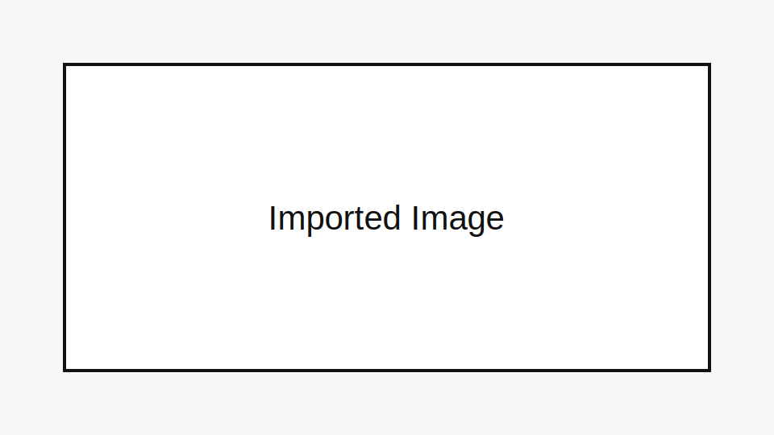

## 本地图片

这张图片来自导入目录中的相对路径，导入后应该被复制到博客的 `assets/imported/`。

## 在线图片

在线资源不复制，保留原始链接。

## 本地视频

<video controls src="media/local-video.mp4"></video>

## 在线视频

<video controls src="https://example.com/video.mp4"></video>
